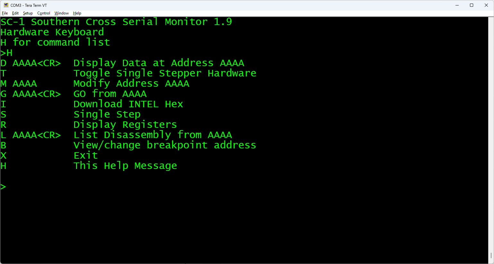
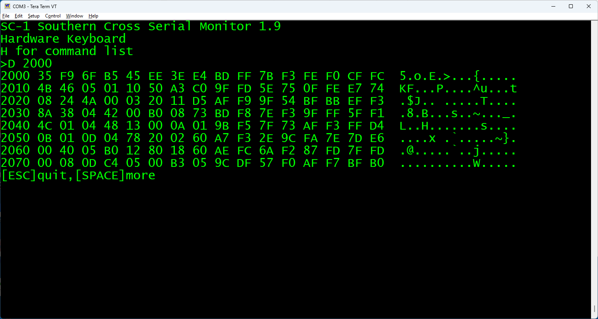
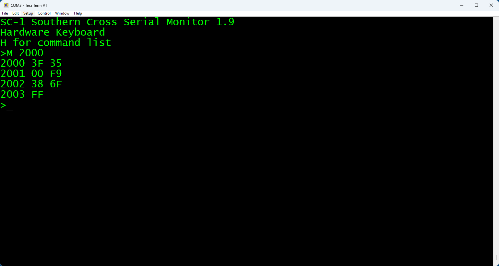
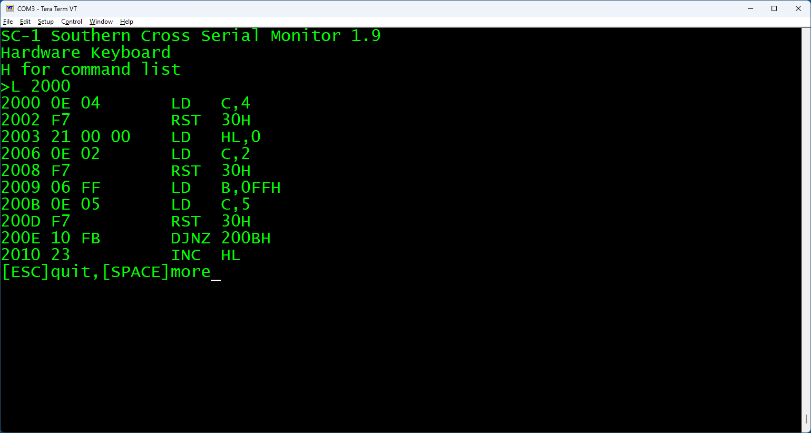
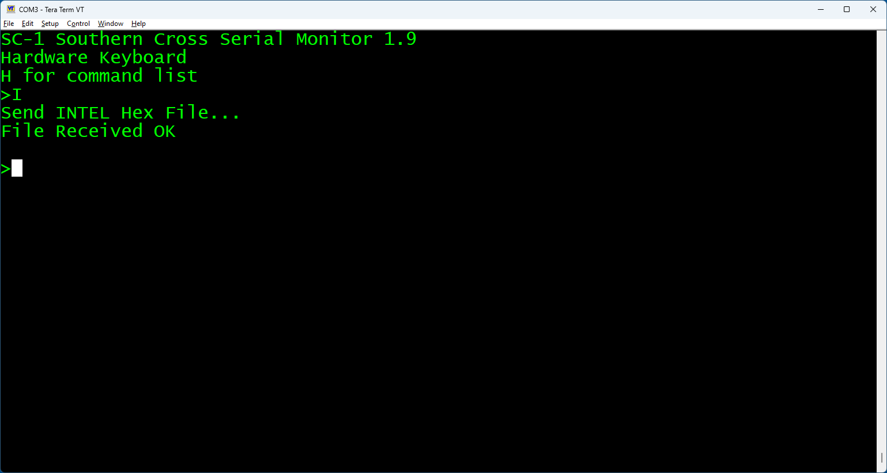
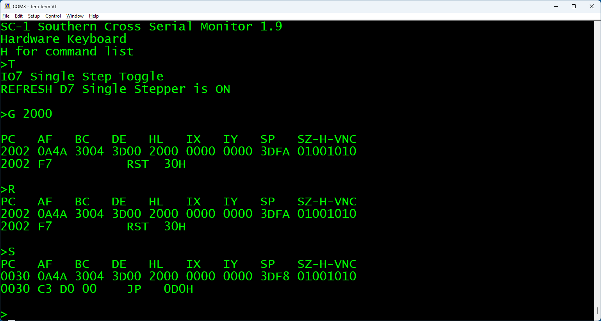
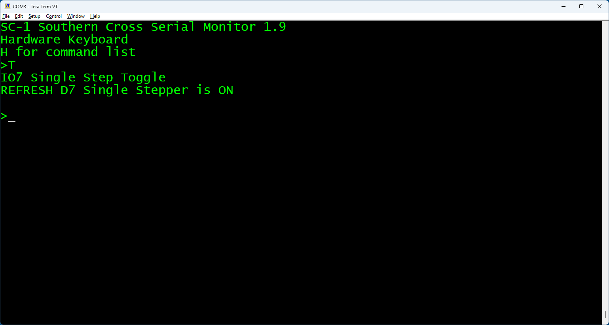
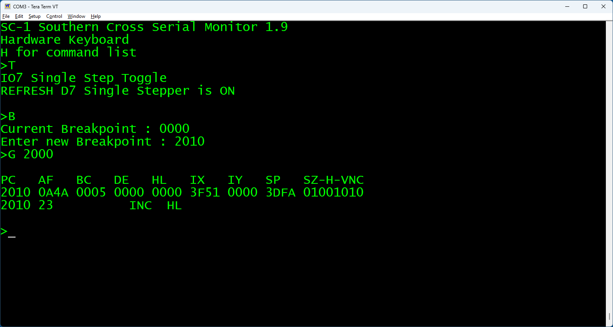

# Southern Cross SCBUG Serial Monitor

The **SCBUG Serial Monitor** provides an interactive debugging interface for the Southern Cross Z80 SBC.

---

## 1. System Setup & Communication Parameters

- **Serial Configuration:** 9600 Baud, 8 Data Bits, No Parity, 2 Stop Bits (9600, N, 8, 2)

- **Starting SCBUG:**
  
  - **Hardware/Keyboard:** Press the function key twice to initialize and start the serial monitor.
  
  - **Software Entry:** Execute `CALL 00A0H` (Vector location) or system call `RST 30H` with `C = 45`.

---

## 2. Commands

Command input is case-insensitive. Hexadecimal inputs accept characters `0`–`9` and `A`–`F` (or `a`–`f`). Press `ESC` at any input prompt to cancel the command and return to the main command prompt `>`.

### `H` — Display Help Menu

- **Syntax:** `H` Displays a quick reference cheat sheet of all available monitor commands.
  
  

### `D` - Display Memory

- **Syntax:** `D AAAA<CR>`

- **Description:** Displays 8 lines (128 bytes total) of memory starting at address `AAAA`. Each line presents the address, 16 hexadecimal byte values, and their printable ASCII equivalents (non-printable bytes display as `.`).

- **Pagination:** Press `[SPACE]` to display the next 8 lines, or `[ESC]` to return to the prompt.
  
  

### `M` — Modify Memory

- **Syntax:** `M AAAA`

- **Description:** Displays the 16-bit address `AAAA` alongside its current byte contents in hexadecimal. Prompts for a new two-digit hex value:

- Enter a valid 2-digit hex byte to overwrite memory at `AAAA`. The pointer auto-increments to `AAAA+1` on success.

- An `?` character is printed if the written byte fails verification (indicates ROM, unmapped memory, or failed RAM).

- Press `ESC` to stop memory modification and exit back to the prompt.
  
  

### `L` — List Disassembly

- **Syntax:** `L AAAA<CR>`

- **Description:** Disassembles and displays 10 lines of Z80 machine code starting at memory address `AAAA`.

- **Pagination:** Press `[SPACE]` to disassemble the next 10 instructions, or `[ESC]` to return to the prompt.
  
  

### `I` — Download Intel Hex File

- **Syntax:** `I`

- **Description:** Places the serial monitor into Intel Hex receive mode. Stream an Intel Hex formatted file over the serial link. Reports `"File Received OK"` upon completion or `"Checksum Error"` if data corruption occurs.
  
  

### `G` — Go / Jump to Address

- **Syntax:** `G AAAA<CR>`

- **Description:** Transfers CPU execution directly to memory address `AAAA`.
  Use the `G` instruction to start a single stepping session.

### `R` — Display Registers

- **Syntax:** `R`

- **Description:** Prints the saved CPU register contents (`PC`, `AF`, `BC`, `DE`, `HL`, `IX`, `IY`, `SP`) along with the individual CPU flags (`SZ-H-VNC`). Also disassembles the instruction currently at the saved `PC` location.
  
  

### `S` — Single Step Instruction

- **Syntax:** `S`

- ***Description:** The contents of all the previously saved registers are restored from RAM and the instruction at the current Program Counter (`PC`) address is executed.

### `T` — Toggle Hardware Single Stepper

- **Syntax:** `T`

- **Description:** Toggles the state of both the original single stepper hardware, flip-flop driven by (`IO7`) , and also flips Bit 7 of the CPU `REFRESH` (`R`) register to enable or disable hardware single-stepping using the SC-DEBUG expansion board.
  
  

### `B` — Breakpoint Management

- **Syntax:** `B`

- **Description:** Displays the current hardware single-step breakpoint address and prompts for a new 16-bit hex address (`AAAA`). 
  Setting the address to `0000H` disables the breakpoint processing.
  The breakpoint address is monitored during single-stepping for an address match, if a match is not made the single stepper will continue stepping through the code without stopping to display the registers.
  If a match is made the single stepper stops, resets the breakpoint address to `0000H` , displays the registers and returns to the command prompt. 
  ***The breakpoint function does not work properly without the single stepping hardware.***
  
  

### `X` — Exit Serial Monitor

- **Syntax:** `X`

- **Description:** Restores the default interrupt / single-step vector (`RST 38H`), restores the caller's stack pointer, outputs `"Bye..."`, and returns control to the 7 segment display and hex keyboard version of the monitor.
